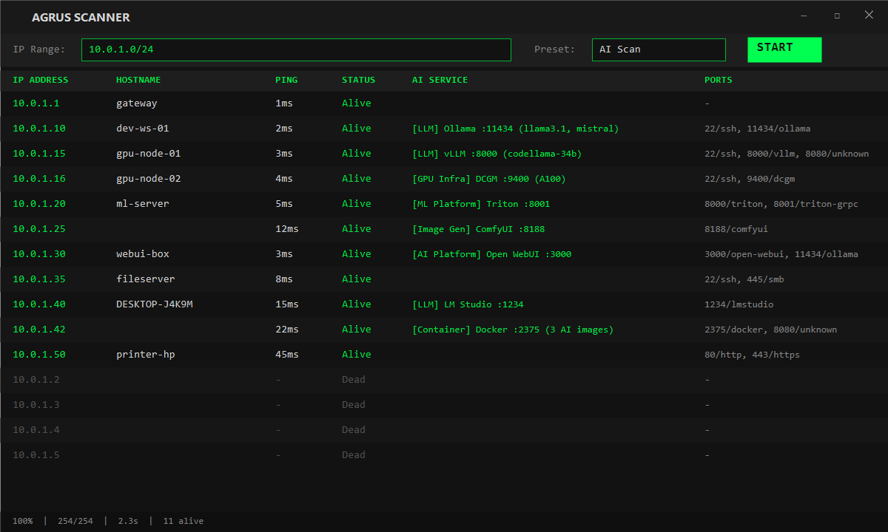

# Agrus Scanner

Network reconnaissance tool with deep AI/ML service detection. Scans your network to discover hosts, open ports, and identifies AI services running across your infrastructure.

Built for security teams, IT admins, and researchers who need visibility into shadow AI, rogue LLM deployments, and GPU infrastructure on their networks.

## Why

There is a growing concern for shadow AI, and this provides a simple way to scan networks.  Also many of the typical scanning tools for windows are slow and have poorly written interfaces, specifically for anyone running a 4k+ monitor.  Agrus Scanner is built in native C#/.NET with WPF — no Electron, no embedded browser — so it launches fast, scans fast, and stays light on resources.  I've been tired of trying to read tiny print so when a friend/client was looking for a way to scan for shadow AI, and without any windows type tool available, it seemed like a natural fit together.

Agrus Scanner was built to close that gap. It goes beyond port scanning by actively probing discovered services with AI-specific API calls, pulling back model names, GPU details, container info, and version data. If someone on your network is running an AI service, Agrus finds it and tells you exactly what it is.



## Install

Download the latest installer from [Releases](https://github.com/NYBaywatch/AgrusScanner/releases):

**[AgrusScanner-Setup.msi](https://github.com/NYBaywatch/AgrusScanner/releases/latest/download/AgrusScanner-Setup.msi)** — self-contained, no .NET runtime needed.

Requires Windows 10/11.

## Features

- **Ping Sweep** - Fast ICMP discovery across subnets (256 concurrent)
- **Port Scanning** - TCP connect scan with preset profiles (Quick, Common, Extended, AI)
- **AI Service Detection** - 45 probe definitions identifying 25+ AI/ML services
- **Docker Container Enumeration** - Detects AI containers via exposed Docker API
- **GPU Infrastructure** - Finds NVIDIA DCGM exporters and inference metrics
- **Real-time Results** - Live-updating UI as scan progresses
- **MCP Server** - Expose scanning tools to AI agents via Model Context Protocol
- **Agent Skills** - Works with Claude Code, OpenClaw, Cursor, and other AgentSkills-compatible tools

## AI Detection Categories

| Category | Services Detected |
|----------|-------------------|
| **LLM** | Ollama, vLLM, HF TGI, llama.cpp, KoboldCpp, LM Studio, LiteLLM, Jan.ai, GPT4All, LocalAI, FastChat, Tabby |
| **Image Gen** | Stable Diffusion (A1111), ComfyUI |
| **ML Platform** | NVIDIA Triton, TorchServe, TensorFlow Serving, MLflow, Ray Serve, BentoML, KServe, MindsDB |
| **AI Platform** | Open WebUI, AnythingLLM, LibreChat, Flowise, Dify, Gradio apps |
| **GPU Infra** | NVIDIA DCGM Exporter, Triton Metrics, TorchServe Metrics |
| **Container** | Docker API with 33 AI image pattern matches |

Detection goes beyond port scanning - the prober queries service-specific API endpoints, extracts model names, versions, GPU info, and container details.

## Usage

### GUI Mode

1. Enter an IP range (CIDR, range, or single IP)
2. Select a scan preset:
   - **Quick** - 6 common ports
   - **Common** - 22 well-known ports
   - **Extended** - 58 service ports
   - **AI Scan** - 28 AI/ML-specific ports with service probing
   - **No port scan** - Ping sweep only
3. Click **START**

AI Scan results show detected services with extracted details:
```
[LLM] Ollama :11434 (llama3, mistral) | [GPU Infra] NVIDIA DCGM :9400 (RTX 4090)
```

### MCP Server Mode

Run the scanner as a headless MCP server with a system tray icon:

```powershell
AgrusScanner.exe --mcp-only
```

This starts a Streamable HTTP MCP server on `http://localhost:8999/mcp` (port configurable in settings). AI agents can then call the scanning tools directly.

**MCP Tools:**

| Tool | Description |
|------|-------------|
| `scan_network` | Ping sweep + port scan + DNS + AI probing across an IP range |
| `probe_host` | Deep-scan a single IP with port scan and AI detection |
| `list_presets` | List available scan presets with port counts |

## AI Agent Integration

### Claude Code

The project includes a `.mcp.json` that connects Claude Code to the scanner. Start the MCP server, then use Claude Code in this project:

```jsonc
// .mcp.json (already included)
{
  "mcpServers": {
    "agrus-scanner": {
      "type": "http",
      "url": "http://localhost:8999/mcp"
    }
  }
}
```

A Claude Code skill is also included at `.claude/skills/agrus-scanner/SKILL.md` that teaches the agent when and how to use the scanning tools.

### OpenClaw

Install the bundled OpenClaw plugin:

```bash
openclaw plugins install ./openclaw-plugin
```

Configure in OpenClaw settings:

```json
{
  "plugins": {
    "entries": {
      "agrus-scanner": {
        "enabled": true,
        "config": { "mcpUrl": "http://localhost:8999/mcp" }
      }
    }
  }
}
```

### Other AgentSkills-Compatible Tools

The skill at `.claude/skills/agrus-scanner/SKILL.md` follows the open [AgentSkills](https://agentskills.io) format and works with any compatible agent (Cursor, Gemini CLI, OpenClaw, etc.). Point your tool at the MCP endpoint and the skill provides usage instructions.

## Keyboard Shortcuts

| Key | Action |
|-----|--------|
| Ctrl + = | Zoom in |
| Ctrl + - | Zoom out |
| Ctrl + 0 | Reset zoom |
| Ctrl + Scroll | Zoom |

## License

[MIT License](LICENSE) — use at your own risk. See LICENSE for full terms.
