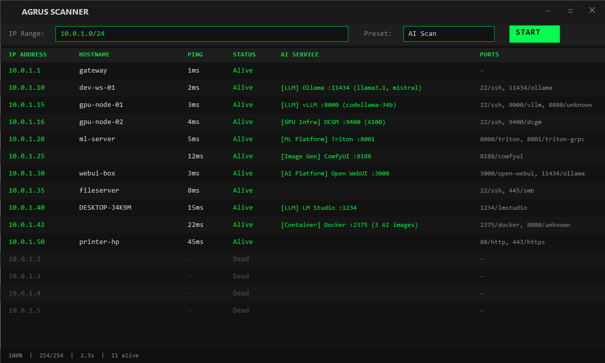

# Agrus Scanner

[](https://jpftech.com/tools/)
[](https://github.com/NYBaywatch/AgrusScanner)
[](https://github.com/NYBaywatch/AgrusScanner/releases/latest)
[](#detection-signatures)
[](#detection-signatures)

Network reconnaissance tool with deep AI/ML service detection. Scans your network to discover hosts, open ports, and identifies AI services running across your infrastructure.

Built for security teams, IT admins, and researchers who need visibility into shadow AI, rogue LLM deployments, and GPU infrastructure on their networks.

## Why

There is a growing concern for shadow AI, and this provides a simple way to scan networks.  Also many of the typical scanning tools for windows are slow and have poorly written interfaces, specifically for anyone running a 4k+ monitor.  Agrus Scanner is built in native C#/.NET with WPF — no Electron, no embedded browser — so it launches fast, scans fast, and stays light on resources.  I've been tired of trying to read tiny print so when a friend/client was looking for a way to scan for shadow AI, and without any windows type tool available, it seemed like a natural fit together.

It also works as a straightforward network scanner — ping sweeps, port scanning, and hostname resolution are all built in. You don't need a separate tool for basic recon. But where Agrus really stands out is AI detection: it goes beyond port scanning by actively probing discovered services with AI-specific API calls, pulling back model names, GPU details, container info, and version data. If someone on your network is running an AI service, Agrus finds it and tells you exactly what it is.

It also runs as an MCP server, so AI agents like Claude Code and OpenClaw can use it as a tool — scan networks, probe hosts, and pull back results autonomously. Point your agent at the endpoint and it handles the rest.



## Install

Download the latest installer from [Releases](https://github.com/NYBaywatch/AgrusScanner/releases), or directly:

**[AgrusScanner-Setup-1.0.1.msi](https://downloads.jpftech.com/AgrusScanner-Setup-1.0.1.msi)** — self-contained, no .NET runtime needed.

Or visit the [Tools page](https://jpftech.com/tools/) for the download link, checksum, and winget install command.

Requires Windows 10/11. The installer and the installed binaries are Authenticode-signed (Azure Trusted Signing, publisher *Joseph Fago*). Once installed, detection signatures keep themselves current; you only need a new installer when the app itself changes.

## What's New

### v1.0 — September 2026 (current)

**Agrus Scanner 1.0 is the first stable release.** The detection engine, the signed signature feed, and the MCP integration are complete and supported. From here on, new AI services are delivered as signature updates and the app version only changes when the engine, UI, or MCP tools change.

- **Self-updating detection signatures** — probes, AI ports, and Docker image patterns ship as a cryptographically signed feed. New services land automatically without reinstalling. See [Detection Signatures](#detection-signatures).
- **MCP server detection** across all three transport generations, with server name, version, and capabilities extracted.
- **Everything is signed** — the MSI, `AgrusScanner.exe`, and `AgrusScanner.dll` are Authenticode-signed via Azure Trusted Signing; releases abort if any is unsigned. Signature packages are signed with a separate key that the app verifies before loading.
- **Settings** — signature updates (Off / Notify only / Auto-install), app update check, and the built-in MCP server can each be turned off.
- 111 probe definitions across 13 categories; 43 automated tests including tamper, wrong-key, downgrade, and live MCP-server fixtures.

Point releases (1.0.x) carry fixes only. Signature versions are dated (for example `2026.09.15.1`) and shown in the status bar.

### v0.4.1 — September 2026

- **Automatic signature updates** — detection signatures now ship as a signed feed, separate from the app. New signatures land automatically without reinstalling. Settings offers Off / Notify only / Auto-install (default), and the status bar shows the active signature version. Every package is signed in CI; the app refuses anything that does not verify against its built-in public key, so a tampered or third-party file is never loaded.
- Settings: app update check can now be turned off from the UI

### v0.4.0 — September 2026

- **MCP server detection** — finds Model Context Protocol servers on the network across all three transport generations: Streamable HTTP (`initialize`), the 2026-07-28 stateless `server/discover`, and legacy HTTP+SSE. Shows the server's self-reported name, version, capabilities (tools / resources / prompts), and protocol version. Sessions opened during detection are closed immediately; no tools are ever called.
- **Signature catalog** — all detection definitions (probes, AI port preset, Docker image patterns) now live in `signatures/catalog.json` and are compiled in as the baseline. Groundwork for v0.4.1's signature feed.
- New AI-preset ports for MCP tooling: 8811 (Docker MCP Gateway), 8931 (Playwright MCP), 6274/6277 (MCP Inspector), 8999 (Agrus), 8123 (Home Assistant, gated to its own probe)
- Settings: the built-in MCP server (`--mcp-only` mode) can now be disabled
- Probe catalog grows to **111 definitions**

### v0.3.5 — September 2026

- **TabbyAPI** detection (LLM) — ExLlamaV2's official API server, fingerprinted via its unauthenticated `/.well-known/serviceinfo` endpoint (the only unauthenticated route TabbyAPI exposes by default)
- **OpenClaw** detection (Agent Platform) — the self-hosted agentic assistant, identified via its gateway health check on its distinctive default port 18789
- Probe catalog grows to **103 definitions**; no dependency updates this week (nothing outdated or vulnerable)

### v0.3.4 — September 2026

- **LMDeploy** (InternLM) detection (LLM) — OpenAI-compatible API server fingerprinted by its distinctive default port 23333
- **exo** detection (LLM) — p2p distributed local-LLM cluster, identified via its dashboard/API on port 52415
- Probe catalog grows to **101 definitions**; dependencies patched

## Features

- **Ping Sweep** - Fast ICMP discovery across subnets (256 concurrent)
- **Port Scanning** - TCP connect scan with preset profiles (Quick, Common, Extended, AI, Deep AI)
- **AI Service Detection** - 111 probe definitions identifying 70+ AI/ML services and MCP servers
- **Self-updating Signatures** - detection definitions arrive automatically through a signed feed; no reinstall for new services
- **Docker Container Enumeration** - Detects AI containers via exposed Docker API
- **GPU Infrastructure** - Finds NVIDIA DCGM exporters and inference metrics
- **Export Results** - Save scan results to CSV or TXT via the toolbar EXPORT button
- **Real-time Results** - Live-updating UI as scan progresses
- **MCP Server** - Expose scanning tools to AI agents via Model Context Protocol
- **Agent Skills** - Works with Claude Code, OpenClaw, Cursor, and other AgentSkills-compatible tools

## AI Detection Categories

| Category | Services Detected |
|----------|-------------------|
| **LLM** | Ollama, vLLM, HF TGI, llama.cpp, KoboldCpp, LM Studio, LiteLLM, Jan.ai, GPT4All, LocalAI, FastChat, Tabby, Xinference, SGLang, text-generation-webui, NVIDIA NIM, NVIDIA Dynamo, OpenLLM, MLX-LM, llamafile, Aphrodite Engine, llama-swap, LMDeploy, exo, TabbyAPI |
| **Image Gen** | Stable Diffusion (A1111), ComfyUI, InvokeAI, SD WebUI Forge, Fooocus-API |
| **Video Gen** | SwarmUI, HunyuanVideo |
| **Voice / STT / TTS** | Speaches, whisper.cpp, OpenedAI-Speech, F5-TTS, GPT-SoVITS, XTTS-API-Server, Coqui XTTS Streaming, Kokoro-FastAPI, Chatterbox-TTS-Server |
| **ML Platform** | NVIDIA Triton, TorchServe, TensorFlow Serving, MLflow, Ray Serve, BentoML, KServe, MindsDB |
| **AI Platform** | Open WebUI, AnythingLLM, LibreChat, Flowise, Dify, SillyTavern, n8n, PrivateGPT, Gradio apps |
| **Agent Platform** | AutoGen Studio, Letta, OpenHands, CrewAI Studio, Langflow, OpenClaw |
| **RAG Platform** | Onyx, R2R, kotaemon, RAGFlow, Quivr, Verba, Khoj |
| **Embeddings** | HF Text Embeddings Inference (TEI), Infinity |
| **Vector DB** | Qdrant, ChromaDB, Weaviate, Milvus |
| **MCP Server** | Any MCP server over Streamable HTTP (`initialize` / `server/discover`) or legacy HTTP+SSE, plus Home Assistant MCP; reports name, version, and tools/resources/prompts |
| **GPU Infra** | NVIDIA DCGM Exporter, Triton Metrics, TorchServe Metrics |
| **Container** | Docker API with 70+ AI image pattern matches |

Detection goes beyond port scanning - the prober queries service-specific API endpoints, extracts model names, versions, GPU info, and container details.

## Detection Signatures

Starting with 1.0, what Agrus can detect is separate from the app itself, the same way an antivirus separates its engine from its definitions.

**How it works**

- Every probe, AI port preset entry, and Docker image pattern lives in one catalog. A copy is built into each release as the baseline, so the app works fully offline.
- New signatures are published to the [`signatures` feed](https://github.com/NYBaywatch/AgrusScanner/releases/tag/signatures) on GitHub, typically weekly as new AI services appear. The app checks the feed a few seconds after launch and once a day after that.
- The active signature version and probe count are shown in Settings and the help popup, and in the status bar when an update is available. Versions are dated, e.g. `2026.09.22.1`.

**Your choices (Settings → Updates → Detection signatures)**

| Mode | Behavior |
|------|----------|
| **Auto-install** (default) | New signatures download and activate silently and apply from the next probed host onward |
| **Notify only** | A link appears in the status bar; click it to install |
| **Off** | Never contacts the feed; the built-in baseline is used |

**How it stays safe**

- Each package is signed in CI with a private key that exists only as a GitHub Actions secret. The app carries the matching public key and refuses any package that fails verification, is older than what is already active, needs a newer app version, or fails structural checks (no duplicates, no shrinking, valid categories).
- A signature package can only add or refine detection. It cannot add code, change what ports are scanned outside the AI preset, or make the scanner send anything other than the fixed set of read-only discovery requests (POST is limited to MCP `initialize` / `server/discover` / `ping`).
- If a downloaded file is tampered with, corrupted, or served by the wrong host, it is discarded and the last good set stays active. Nothing is ever loaded from disk without the same checks.

**What still needs an app update**

Rich detail extraction for a brand-new service (model lists, GPU names) is code, so a signature can label a service before the next release shows its details. Engine, UI, and MCP-tool changes are also app releases, which the existing update check announces.

**Contributing a signature**

Add an entry to [`signatures/catalog.json`](signatures/catalog.json) and open a pull request; the catalog gates in CI validate it and, once merged, the feed publishes automatically. Details are in [docs/DEVELOPER.md](docs/DEVELOPER.md#signature-feed).

## Usage

### GUI Mode

1. Enter an IP range (CIDR, range, or single IP)
2. Select a scan preset:
   - **Quick** - 6 common ports
   - **Common** - 22 well-known ports
   - **Extended** - 58 service ports
   - **AI Scan** - 38 AI/ML-specific ports with service probing
   - **Deep AI Scan** - All 65535 ports with full AI probing (slow but complete)
   - **No port scan** - Ping sweep only
3. Click **START**
4. After scanning, click **EXPORT** to save results as CSV or TXT

AI Scan results show detected services with extracted details:
```
[LLM] Ollama :11434 (llama3, mistral) | [GPU Infra] NVIDIA DCGM :9400 (RTX 4090)
```

### MCP Server Mode

Run the scanner as a headless MCP server with a system tray icon:

```powershell
AgrusScanner.exe --mcp-only
```

This starts a Streamable HTTP MCP server on `http://localhost:8999/mcp` (port configurable in settings). AI agents can then call the scanning tools directly.

> **Security note:** The MCP server binds to `localhost` only and validates Host headers to block DNS rebinding attacks. Only processes on your own machine can connect. Do not expose this server to the network via reverse proxy or tunnel without adding your own auth layer.

**MCP Tools:**

| Tool | Description |
|------|-------------|
| `scan_network` | Ping sweep + port scan + DNS + AI probing across an IP range |
| `probe_host` | Deep-scan a single IP with port scan and AI detection |
| `list_presets` | List available scan presets with port counts |

## AI Agent Integration

### Claude Code

The project includes a `.mcp.json` that connects Claude Code to the scanner. Start the MCP server, then use Claude Code in this project:

```jsonc
// .mcp.json (already included)
{
  "mcpServers": {
    "agrus-scanner": {
      "type": "http",
      "url": "http://localhost:8999/mcp"
    }
  }
}
```

A Claude Code skill is also included at `.claude/skills/agrus-scanner/SKILL.md` that teaches the agent when and how to use the scanning tools.

### OpenClaw

Install the bundled OpenClaw plugin:

```bash
openclaw plugins install ./openclaw-plugin
```

Configure in OpenClaw settings:

```json
{
  "plugins": {
    "entries": {
      "agrus-scanner": {
        "enabled": true,
        "config": { "mcpUrl": "http://localhost:8999/mcp" }
      }
    }
  }
}
```

### Other AgentSkills-Compatible Tools

The skill at `.claude/skills/agrus-scanner/SKILL.md` follows the open [AgentSkills](https://agentskills.io) format and works with any compatible agent (Cursor, Gemini CLI, OpenClaw, etc.). Point your tool at the MCP endpoint and the skill provides usage instructions.

## Privacy & Updates

Agrus Scanner makes two kinds of outbound requests, both optional and both visible in Settings → Updates:

- **App update check** on startup to `api.jpftech.com`, sending only the app version and OS version. No personal data, machine IDs, or IP addresses are stored. Toggle: *Check for app updates on startup*.
- **Signature feed check** to `downloads.jpftech.com` on startup and daily, fetching a small manifest and, when newer, the signed package. No identifying data is sent; the server only counts how many checks happen per day, which is what the "Active installs" badge shows. Toggle: *Detection signatures* → Off.

Scan traffic itself only goes to the IP range you enter. Settings are stored in `%LOCALAPPDATA%\AgrusScanner\settings.json`; an installed signature package lives alongside it as `signatures.agsig`.

## Security

Hardening carried through to 1.0:

- **Code signing** — MSI, exe, and dll are Authenticode-signed (Azure Trusted Signing); the release pipeline refuses to publish if any signature is missing or invalid
- **Signed detection feed** — signature packages are ECDSA P-256 signed and verified before use; downgrade, oversize, decompression-bomb, and malformed packages are rejected, and a package cannot introduce arbitrary requests (see [Detection Signatures](#detection-signatures))
- **Bounded probes** — streaming (SSE) responses are cut off at 1.5 s / 64 KB; MCP sessions opened during detection are closed immediately and no tools are ever invoked
- **Input limits** — CIDR and range parsing capped at 65,536 addresses to prevent memory exhaustion
- **Path traversal protection** — MCP `export_results` restricted to the user's Documents folder
- **DNS rebinding defense** — MCP server validates Host headers, rejecting non-localhost requests
- **Response size cap** — HTTP probe responses capped at 1 MB to block memory bombs from malicious servers
- **CSV injection prevention** — Export escapes formula-injection characters (`=`, `+`, `-`, `@`)
- **NTLM protection** — Removed SMB shell-open to prevent credential disclosure to untrusted hosts
- **Diagnostic logging** — Suppressed exceptions now log to `System.Diagnostics.Trace` for visibility
- **No hardcoded secrets** — Build signing credentials moved to environment variables

## Keyboard Shortcuts

| Key | Action |
|-----|--------|
| Ctrl + C | Copy selected IP address |
| Ctrl + = | Zoom in |
| Ctrl + - | Zoom out |
| Ctrl + 0 | Reset zoom |
| Ctrl + Scroll | Zoom |
| Right-click | Context menu (copy, open services) |

## License

[MIT License](LICENSE) — use at your own risk. See LICENSE for full terms.
